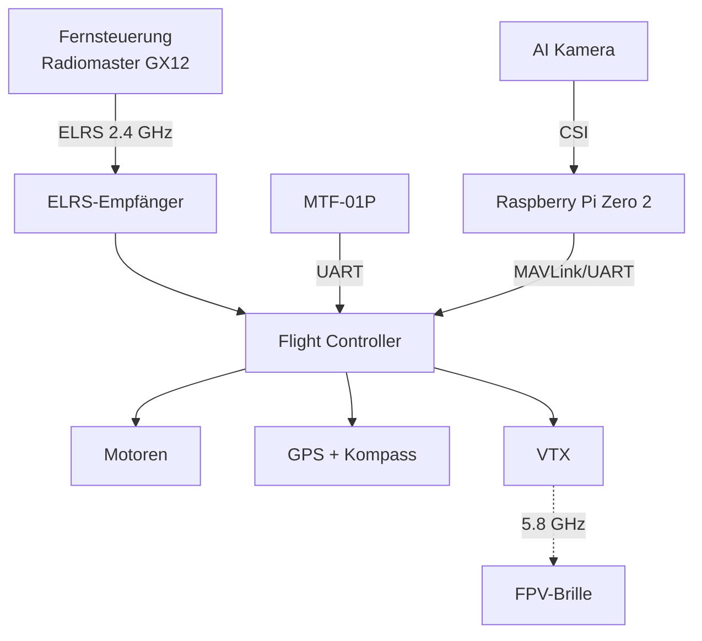

# Hardware-Übersicht

Hier findet ihr eine Übersicht aller Hardware-Komponenten, die im Projekt verwendet werden.

## Ausstattung pro Team

Jedes Team erhält folgende Hauptkomponenten:

- :material-quadcopter: **FPV-Drohne 3,5"** mit CineWhoop-Rahmen (flugbereit)
- :material-glasses: **Skyzone Cobra X** FPV-Brille
- :material-battery: **Li-Ion Akkus** (3 Stück)
- :material-remote: **Radiomaster GX12 ELRS** Fernsteuerung
- :material-raspberry-pi: **Raspberry Pi Zero 2 WH**
- :material-camera: **Raspberry Pi AI Kameramodul**
- :material-radar: **MicroAir MTF-01P** (LiDAR + Optical Flow)

!!! warning "Sicherheitshinweis"
    Vor jedem Flug sollte ein **Smoke Stopper** verwendet werden, um Kurzschlüsse zu vermeiden. Niemals ohne Propellerschutz im Innenraum fliegen.

## Komponentenübersicht

=== "Flugkomponenten"

    Komponenten, die direkt für den Flug benötigt werden:

    - Frame mit Propellerschutz (CineWhoop)
    - Flight Controller mit Motorsteuerung
    - 4× Motoren
    - 4× Propeller (Gemfan D90-5 / HQProp DT90MMX5)
    - ELRS-Empfänger
    - GPS-Empfänger mit Kompass

=== "FPV / Video"

    - FPV-Kamera
    - Videosender (VTX)
    - Skyzone Cobra X FPV-Brille
    - A/V-Video-Grabber (MacroSilicon MS210x)

=== "KI / Companion"

    - Raspberry Pi Zero 2 WH
    - Raspberry Pi AI Kameramodul
    - 32 GB MicroSD-Karte

## Architektur

## Werkzeug & Zubehör

- Imbus- und Sechskant-Schlüssel (1,5 / 2,0 / 4,0 / 5,5 / 8,0 mm)
- 48-teiliger Präzisions-Bitsatz
- SkyRC B6neo+ Ladegerät
- Speedybee Adapter V3
- CP2102-USB-UART-Adapter
- Power Bank 20000 mAh PD 20 W

## Weiterführende Seiten

- [Drohne (Frame & Flight Controller)](drohne.md)
- [Raspberry Pi Zero 2](raspberry-pi.md)
- [AI Kameramodul](ai-camera.md)
- [MTF-01P Sensor](mtf-01p.md)
- [Fernsteuerung & FPV-System](funk-fpv.md)
