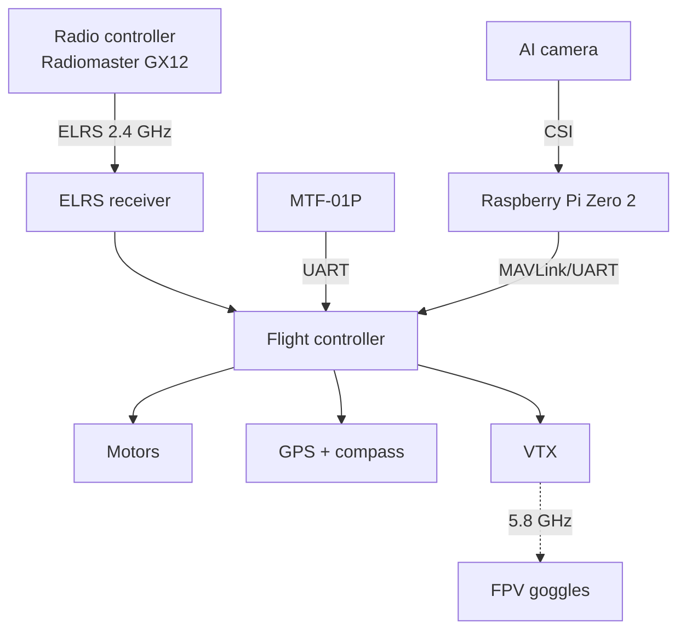

# Hardware Overview

This page gives an overview of all hardware components used in the project.

## Equipment per team

Each team receives the following main components:

- :material-quadcopter: **3.5" FPV drone** with CineWhoop frame (flight-ready)
- :material-glasses: **Skyzone Cobra X** FPV goggles
- :material-battery: **Li-Ion batteries** (3 pieces)
- :material-remote: **Radiomaster GX12 ELRS** radio controller
- :material-raspberry-pi: **Raspberry Pi Zero 2 WH**
- :material-camera: **Raspberry Pi AI Camera Module**
- :material-radar: **MicroAir MTF-01P** (LiDAR + Optical Flow)

!!! warning "Safety note"
    Always use a **Smoke Stopper** before powering up the drone, to prevent damage from short circuits. Never fly indoors without the propeller guard.

## Component overview

=== "Flight components"

    Components required directly for flight:

    - Frame with propeller guard (CineWhoop)
    - Flight controller with motor control
    - 4× motors
    - 4× propellers (Gemfan D90-5 / HQProp DT90MMX5)
    - ELRS receiver
    - GPS receiver with compass

=== "FPV / Video"

    - FPV camera
    - Video transmitter (VTX)
    - Skyzone Cobra X FPV goggles
    - A/V video grabber (MacroSilicon MS210x)

=== "AI / Companion"

    - Raspberry Pi Zero 2 WH
    - Raspberry Pi AI Camera Module
    - 32 GB MicroSD card

## Architecture

## Tools & accessories

- Hex and Allen keys (1.5 / 2.0 / 4.0 / 5.5 / 8.0 mm)
- 48-piece precision bit set
- SkyRC B6neo+ charger
- Speedybee Adapter V3
- CP2102 USB-UART adapter
- Power bank 20000 mAh PD 20 W

## Further reading

- [Drone (Frame & Flight Controller)](drone.md)
- [Raspberry Pi Zero 2](raspberry-pi.md)
- [AI Camera Module](ai-camera.md)
- [MTF-01P Sensor](mtf-01p.md)
- [RC & FPV System](rc-fpv.md)
